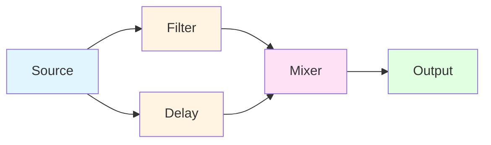
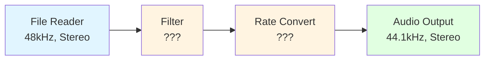
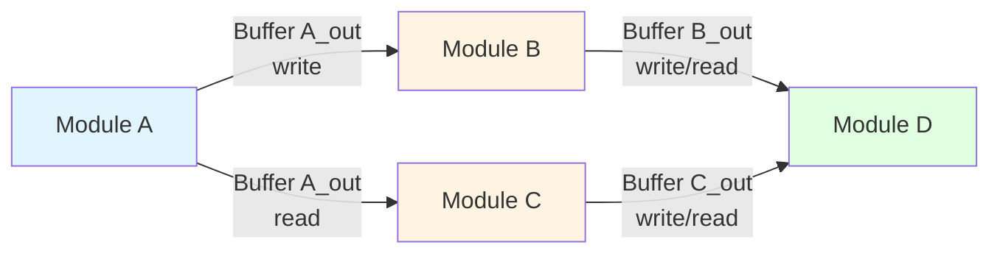

# Graph Preparation Design

## Overview
This document describes the design and algorithms for preparing a DSP Graph for execution. Graph preparation transforms a graph from its initial configured state into a ready-to-execute state. This involves three major steps: determining processing order, propagating signal specifications, and allocating buffers.

This document sits between the high-level concepts in the Project Concept document and the detailed specifications in the Module Spec document. It focuses on the "why" and "what" of graph preparation, providing architectural context for implementation decisions.

## Graph Preparation Steps

### 1. Processing Order Determination
**Status: Complete**

Processing order determination analyzes the connection dependencies between modules to establish the sequence in which modules must execute. A module can only run after all modules feeding its inputs have completed.

**Key Concepts:**
- **Dependency Analysis**: Each connection creates a dependency relationship where the destination module depends on the source module
- **Topological Sort**: Processing order is determined using a topological sort algorithm that orders modules respecting all dependencies
- **Hierarchical Flattening**: Nested graphs are flattened to qualified names (e.g., "subgraph.module") to create a single execution order
- **Cycle Detection**: Circular dependencies are detected and reported as errors

**Example Processing Order:**

Valid processing order: `Source → Filter → Delay → Mixer → Output`
- Source must run first (no dependencies)
- Filter and Delay can run after Source (in either order)
- Mixer must wait for both Filter and Delay
- Output runs last

**Implementation Location**: Graph class `determine_proc_order()` method

### 2. Signal Spec Propagation
**Status: Deferred - Future Work**

Signal spec propagation is the process of determining the format characteristics (channels, sample rate) of signals flowing through the graph. This information allows modules to validate compatibility and configure themselves appropriately.

#### Why It's Complex
Signal spec propagation is deferred because it involves several interacting complexities:

- **Bidirectional Propagation**: Some modules specify their output formats (like oscillators or file readers), while others specify their input requirements (like audio outputs). Specs must propagate both forward and backward through the graph.
- **Format Transformation**: Some modules change signal formats (sample rate converters, channel splitters/mixers), requiring rules for how specs transform through different module types.
- **Constraint Solving**: When multiple modules place requirements on the same signal, the system must determine if a valid solution exists and what it is.
- **Module Capabilities**: Different modules support different format flexibilities - some are format-agnostic, others require specific configurations.

**Bidirectional Propagation Example:**

Forward propagation: File Reader specifies 48kHz stereo → flows forward
Backward propagation: Audio Output requires 44.1kHz stereo → flows backward
Result: Rate converter must transform 48kHz → 44.1kHz, Filter operates at 48kHz

#### Simplified Approach for Initial Development
To avoid this complexity during initial development, the system uses these simplifications:
- **Single Channel Assumption**: All signals are assumed to be single channel
- **Global Sample Rate**: One sample rate applies to the entire algorithm
- **Manual Configuration**: Developers explicitly configure format requirements rather than relying on automatic propagation

#### Future Design Considerations
When signal spec propagation is implemented, it will likely involve:
- Module capability declarations (which formats a module supports)
- Propagation rules for different module types
- Constraint satisfaction algorithms
- Validation and error reporting for incompatible configurations

### 3. Buffer Assignment and Allocation
**Status: Current Focus**

Buffer assignment and allocation determines where signal data is stored and ensures appropriate memory is available for processing.

#### Conceptual Foundation

**Signals and Buffers:**
A Signal is a logical entity representing audio data flowing between modules. A Buffer is the physical storage (memory) that holds the signal's sample data. Each signal requires a buffer to store its data.

**Buffer Ownership:**
The conceptual model assigns buffer ownership to module outputs. When a module produces a signal on its output port, it writes to that output's buffer. Downstream modules consuming that signal read from the same buffer. Signal flow is unidirectional - feedback loops are implemented within modules, not through external connections.

**Current Implementation (Python):** Buffers are exclusively owned by the module output that produces them. Each output port has its own dedicated buffer that no other module output writes to.

**Future (Embedded):** Buffer memory may be shared between outputs of different modules to reduce memory requirements, as long as those modules run at non-overlapping times in the processing order. The ownership model from the module's perspective remains unchanged - each module still writes only to its own output buffers.

Module A owns and writes `Buffer A_out`, which is read by both B and C
Module B owns `Buffer B_out`, Module C owns `Buffer C_out`
(In embedded implementations, the underlying memory for these buffers might be reused)

**Buffer Lifetimes:**
A buffer must remain valid from the time its owning module produces data until all consuming modules have read it. In the processing order sequence, this means a buffer is:
1. Written by the source module
2. Read by zero or more destination modules
3. Available for reuse after the last reader has executed

#### Python Implementation Strategy

**Simplified Allocation:**
For Python development environments, buffer allocation uses a straightforward approach:
- Each output port of each module owns a dedicated buffer
- Buffers are implemented as NumPy arrays (vectors for single channel, 2D arrays for multichannel)
- No buffer sharing or reuse between different module outputs
- Memory conservation is not a concern on modern development systems

**Benefits of Simple Approach:**
- Straightforward implementation with clear ownership
- No complex lifetime analysis required
- Easy debugging - each signal has its own distinct storage
- Matches Python's memory-abundant environment

**Trade-offs:**
This approach uses more memory than necessary, as buffers are not reused. This is acceptable for Python development but would be reconsidered for embedded systems.

#### Embedded/C++ Implementation Considerations

**Memory Conservation:**
Embedded systems have strict memory constraints, making buffer reuse essential. A sophisticated buffer assignment algorithm can significantly reduce memory footprint by sharing the same physical memory between multiple logical buffers.

**Buffer Sharing Strategy:**
The same physical buffer memory can be shared between outputs of different modules when:
- The modules execute at non-overlapping times in the processing order
- All consumers of the earlier output have completed processing before the later module writes
- The buffer size and format are compatible

This sharing is transparent to modules - each still "owns" and writes exclusively to its output buffers, but the underlying memory storage is reused.

**Lifetime Analysis:**
Sophisticated buffer sharing requires analyzing when each buffer's memory becomes available for reuse:
1. Identify the last module in processing order that reads each buffer
2. After that module executes, mark the underlying memory available for sharing
3. Assign physical memory to output buffers using a bin-packing or graph-coloring approach
4. Minimize total buffer memory required

The goal is to map multiple logical buffers (one per module output) onto a smaller set of physical memory buffers through careful scheduling.

**Buffer Lifetime Visualization:**

```mermaid
gantt
    title Buffer Lifetimes in Processing Order
    dateFormat X
    axisFormat %s

    section Module A
    A executes (writes A_out)    :a1, 0, 1

    section Buffer A_out
    A_out valid                   :active, b1, 1, 4

    section Module B
    B executes (reads A_out)      :a2, 1, 2

    section Buffer B_out
    B_out valid                   :active, b2, 2, 5

    section Module C
    C executes (reads A_out)      :a3, 2, 3

    section Buffer C_out
    C_out valid                   :active, b3, 3, 5

    section Module D
    D executes (reads B_out, C_out) :a4, 4, 5
```

After Module C (last reader of A_out), A_out's memory can be shared with other buffers
After Module D, the memory for B_out and C_out can be reused

**Future Work:**
The embedded buffer sharing/assignment algorithm will be designed when moving algorithms to C++. The Python framework establishes the conceptual model (ownership, lifetimes, signal flow) that the embedded version will optimize through memory reuse.

## Design Decisions and Rationale

### Separation of Concerns
Each preparation step addresses a distinct aspect of graph execution:
- **Processing Order**: When modules run relative to each other
- **Signal Specs**: What format data has flowing through connections
- **Buffer Allocation**: Where the data is physically stored

This separation allows each problem to be solved independently and enables different optimization strategies appropriate to each concern.

### Incremental Implementation
By deferring signal spec propagation, the system can become functional sooner while the complex constraint-solving aspects are designed more carefully. The simplified assumptions (single channel, single rate) don't prevent building useful algorithms in the short term.

### Platform-Appropriate Strategies
The recognition that Python and embedded environments have different constraints leads to different buffer allocation strategies. Python prioritizes simplicity and debugging clarity, while embedded will prioritize memory efficiency. Both use the same conceptual model, ensuring Python prototypes map cleanly to embedded implementations.

## Open Questions and Future Topics

1. **Signal Spec Module API**: What interface should modules use to declare their format capabilities and requirements?
2. **Format Transformation Rules**: How should the system encode rules for modules that change signal formats?
3. **Buffer Size Specification**: How are buffer sizes determined? Fixed per algorithm? Per module configuration? Related to processing latency requirements?
4. **Embedded Buffer Strategy**: What specific algorithm for buffer reuse? Graph coloring? Greedy assignment? Buffer pools?
5. **Validation Points**: At what points should the system validate that specs are compatible and buffers are correctly assigned?

## Related Documents
- **Project Concept.md**: High-level goals and conceptual overview
- **Module Spec.md**: Detailed class specifications for Module and Graph
- **Development Journal.md**: Implementation discussions and decisions

---

*This document will evolve as graph preparation features are implemented and refined.*
